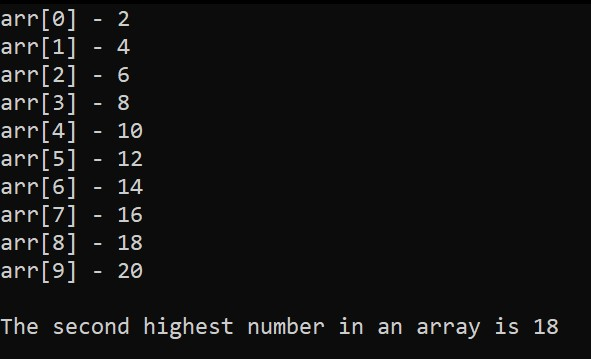

# Second Highest Integer (quick jeepney practice from gent. to karuhatan)

This is a small and quick C programming practice I coded entirely on my phone while riding a jeep.  
The goal is to find the second highest number in a given integer array.

## Screenshot

## Code
The program:
- Accepts a hardcoded array of integers
- Finds the second highest value
- Prints the result

## Reason

Just a casual praactice session to keep my coding reflexes sharp, even on the road ^^
